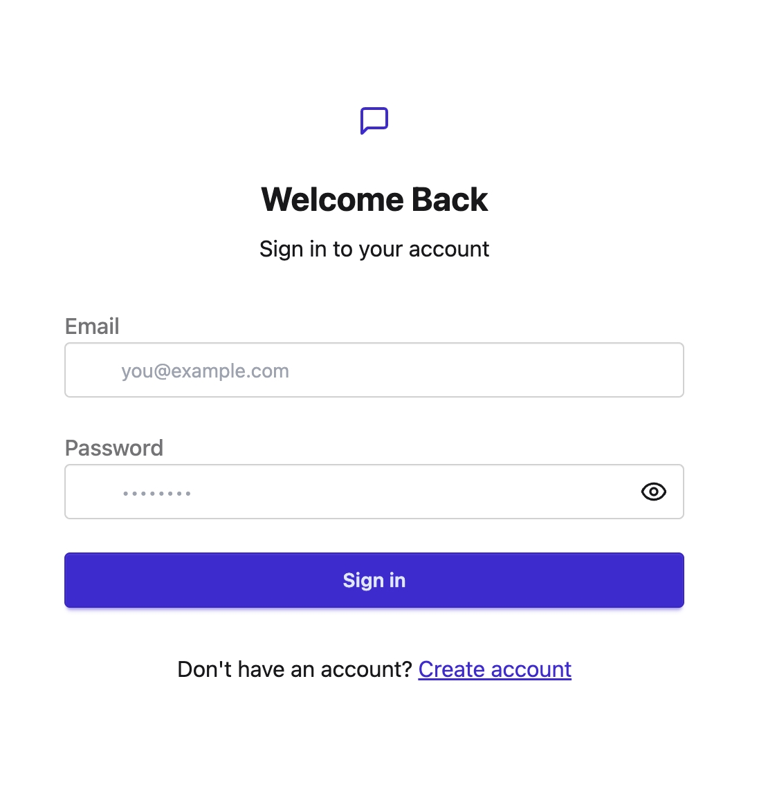
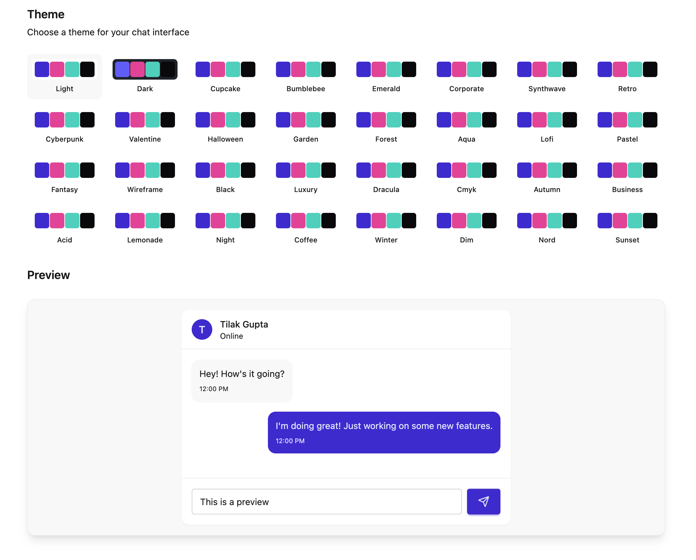
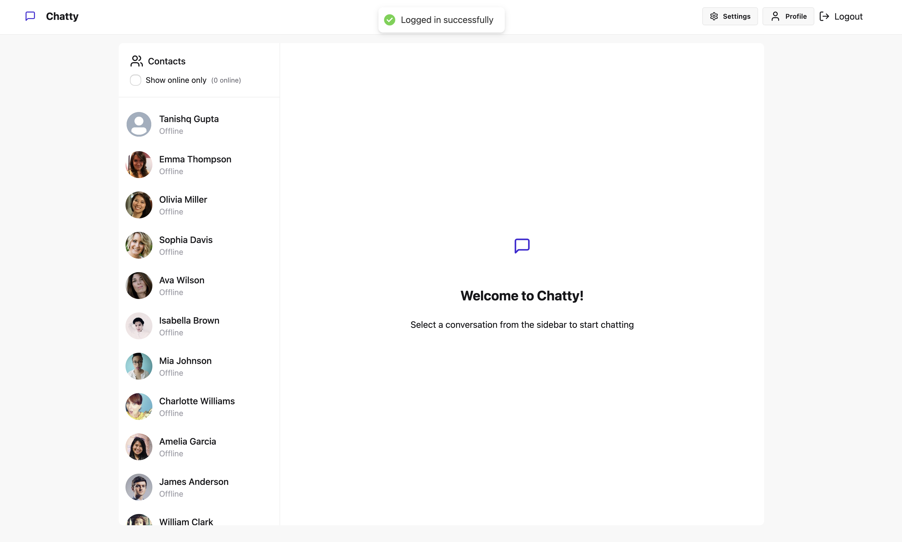
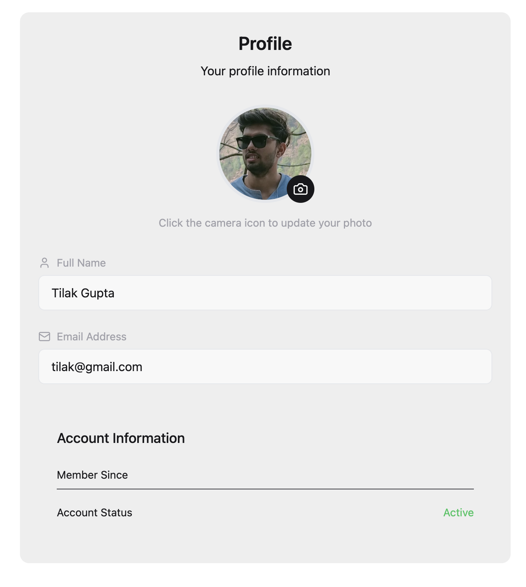

# Chatty - Chat Application

[Live Demo 🚀](https://chat-app-1mar.onrender.com)

Welcome to **Chatty**, a modern, full-featured chat application with real-time messaging, theming, and user profile management. This project demonstrates best practices in full-stack web development, UI/UX design, and scalable architecture.

---

## Table of Contents

- [Features](#features)
- [Tech Stack](#tech-stack)
- [Methodologies](#methodologies)
- [Getting Started](#getting-started)
- [Project Structure](#project-structure)

---

## Screenshots

### 1. Login Page


### 2. Theme Selection & Chat Preview


### 3. Main Chat Interface


### 4. User Profile


---

## Features

- 🔒 Secure authentication (login/signup)
- 💬 Real-time messaging
- 🎨 Multiple chat themes
- 👤 User profile management
- 🟢 Online/offline status
- 🖼️ Profile picture upload
- Responsive UI

---

## Tech Stack

**Frontend:**
- React.js (with Hooks)
- Tailwind CSS / DaisyUI (for theming)
- Context API / Redux (state management)
- Axios (API requests)

**Backend:**
- Node.js
- Express.js
- MongoDB (Mongoose)
- Socket.io (real-time communication)
- JWT (authentication)

**Other:**
- Cloudinary (profile image uploads)
- Render.com (deployment)

---

## Methodologies

- **Component-based architecture:** Modular, reusable React components.
- **RESTful API design:** Clean separation between frontend and backend.
- **Real-time communication:** Socket.io for instant messaging.
- **Responsive design:** Mobile-first, accessible UI.
- **State management:** Context API/Redux for global state.
- **Security:** JWT for authentication, bcrypt for password hashing.
- **CI/CD:** Automated deployment via Render.com.

---

## Getting Started

### Prerequisites

- Node.js (v16+)
- npm or yarn
- MongoDB (local or Atlas)

### Installation

1. **Clone the repository:**
   ```bash
   git clone https://github.com/your-username/chat-app.git
   cd chat-app
   ```

2. **Install dependencies:**
   ```bash
   # For backend
   cd backend
   npm install

   # For frontend
   cd ../frontend
   npm install
   ```

3. **Set up environment variables:**

   - Create a `.env` file in the `server` directory:
     ```
     MONGO_URI=your_mongodb_connection_string
     JWT_SECRET=your_jwt_secret
     CLOUDINARY_URL=your_cloudinary_url
     ```

4. **Run the app locally:**

   - Start the backend:
     ```bash
     cd backend
     npm run dev
     ```

   - Start the frontend:
     ```bash
     cd ../frontend
     npm run dev
     ```

5. **Visit** `http://localhost:5173` in your browser.

---

## Project Structure

```
chat-app/
  ├── backend/    # React frontend
  ├── frontend/   # Node/Express backend
  ├── lib/        # Project screenshots for README
  └── README.md
```

---

## License

This project is licensed under the MIT License - see the [LICENSE](LICENSE) file for details.